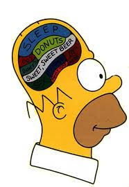

```{r setup, include=FALSE}
knitr::opts_chunk$set(echo = FALSE, cache = TRUE, fig.align='center')

library(dplyr)
library(ggplot2)
library(tibble)


```

## Why learn regression?
20th Century Motivation - An End in Itself

Two types of data:

1. Experimental: Researcher has control over which cases receive an intervention.
2. Observational: Researcher has to make due with data that are available.

The first case corresponds to the type of scientific experiments learned about in high school science classes. 

But there are a lot of phenomena we want to study where we cannot control what is going on.  We need an expanded research tool kit to deal with these types of cases.

## Why learn regression?

Examples of questions answered with observational data:

- Do economic crises increase the likelihood of war?
- Do carbon emissions affect average temperatures?
- Does smoking increase the risk of chronic illness?
- Do sales of umbrellas predict sales of rain boots?

## Why learn regression?

When we cannot randomize levels of the _independent variable_, we can be less certain it is having an effect on our _dependent variable_

- Dependent variable: The outcome we are seeking to explain.  Typically denoted as _Y_.
- Independent variable: What we think can explain the outcome.  Typically denoted as _X_.

Regression does two things for us:

First, it tells us how much we can expect a dependent variable to change each time we change the independent variable.
- People who smoke more tend to have more illnesses
- Regression will tell us how many illnesses to expect given a number of cigarattes smoked.


## Why learn regression?

```{r scatter1}

set.seed(3)
cigs<-round(runif(100,-.4,20.4))
lbs<-rnorm(100,125+5*cigs+rnorm(100,0,50),25)
ill<-.75*cigs + .05*lbs + rnorm(100,0,1)
df<-data.frame(cigs,lbs,ill)

lm_eqn = function(m) {

  l <- list(a = format(coef(m)[1], digits = 3),
      b = format(abs(coef(m)[2]), digits = 3),
      r2 = format(summary(m)$r.squared, digits = 3))

  if (coef(m)[2] >= 0)  {
    eq <- substitute(italic(y) == a + b %.% italic(x)*","~~italic(r)^2~"="~r2,l)
  } else {
    eq <- substitute(italic(y) == a - b %.% italic(x)*","~~italic(r)^2~"="~r2,l)    
  }

  as.character(as.expression(eq))
  }


ggplot(df, aes(cigs,ill)) + geom_point() +
  geom_smooth(method="lm", color = "firebrick") + 
  geom_text(aes(x = 17, y = 5, label = lm_eqn(lm(ill ~ cigs, df))), parse = TRUE) +
  labs(x="Number of Cigarettes",y="Number of Illnesses")


```


## Why learn regression?

Regression also allows us to sort through competing theories.  This is done by _controlling_ for other possible independent variables.

- I think smoking causes chronic illness.  But what if the real problem is obesity, and it just so happens that smokers are more likely to be obese?
- What if the real issue is lack of access to affordable health care, and smokers tend to be poorer?
- How do I partial the _independent_ effect of each possible variable?  What is their _total_ effect?

## Competing Explanations

```{r scatter2}
ggplot(df, aes(cigs,ill)) + geom_point() +
  geom_smooth(method="lm") + 
  labs(x="Number of Cigarettes",y="Number of Illnesses")
```

## Competing Explanations

```{r, echo=FALSE, message=FALSE, warning=FALSE}
ggplot(df, aes(cigs,lbs)) + geom_point() +
  geom_smooth(method="lm") + 
  labs(x="Weight",y="Number of Illnesses")
```

## Why learn regression?

How do we know if the increase in illnesses is being driven by smoking, obesity, or both? 

_To control_ means to vary one independent variable while holding the other independent variables constant at a certain value.

- Does smoking impact chronic illness for people earning median incomes?
- Does smoking impact chronic illness for people weighing 250 pounds?

When we control for an alternative explanation, we are getting the _independent_ effect (also called the _partial effect_ of a variable.  This is the effect net of any overlapping effect from another variable.


## Why learn regression?

21st Century Motivation: Pre-requisite for Modern Methods

- Models for Causal Inference
    - Heightened focus on assumptions that allow for statements of causality
    - Leads to methods beyond regression (matching, instrumental variables, regression discontinuity)

- Machine Learning
    - Tree-based algorithms follow regression logic
    - Neural networks (regression on steroids)
    


## Interpreting Regression

The only math you need to know to interpret regression is a high school freshman-level course in algebra.
Recall learning about the slope of a line.  The slope represents the steepness of the line.

- Rise over run: Take b steps up each time you take one step over.
- For a slope of 5: Take five steps up each time you take one step over.
- For a slope of $-5$: Take five steps _down_ each time you take one step over.

The _y-intercept_ is the point where the line crosses the y-axis on a graph.


## Interpreting Regression

```{r regplot}

X<-seq(-10,10,by=.01)
Y<- 10+5*X
y2<- 10 - (5*X)

temp_data <- data_frame(X = X, Y = Y, y2 = y2)

ggplot(temp_data, aes(x = X, y =Y)) + geom_line(color = "firebrick") + geom_line(aes(x = X, y = y2), color = "dodgerblue3") +
  geom_hline(yintercept = 0, color = "gray", linetype = "dashed") +
  geom_vline(xintercept = 0, color = "gray", linetype = "dashed") +
  geom_text(aes(x = 2.5, y = 10, label = "Intercept = 10") ) +
  geom_text(aes(x = 7, y = 38, label = "b = 10"), color = "firebrick" ) +
  geom_text(aes(x = -5.5, y = 45, label = "b = -10"), color = "dodgerblue3" ) +
  geom_point(aes(x = 0, y = 10)) +
  geom_segment(aes(x = -8, y = 50, xend = -8, yend = 35), linetype = "dashed", color = "dodgerblue3") +
  geom_segment(aes(x = -8, y = 35, xend = -5, yend = 35), linetype = "dashed", color = "dodgerblue3") +
  geom_segment(aes(x = 5, y = 35, xend = 5, yend = 50), linetype = "dashed", color = "firebrick") +
  geom_segment(aes(x = 5, y = 50, xend = 8, yend = 50), linetype = "dashed", color = "firebrick") 

```


## Interpreting Regression

From algebra: an equation in slope-intercept form:
$$
Y = a + b X
$$
Here _a_ is the intercept and $b$ is the slope. For the previous graph:
$$
\begin{eqnarray*}
Y &=& 10 + 5X \\
Y &=& 10 - 5X
\end{eqnarray*}
$$
Note the _regression model_ that is the best fit to a population is summarized with Greek letters $\alpha$ (alpha) and $\beta$ (beta)
$$
Y = \alpha + \beta X
$$

## Interpreting Regression

Regression finds the line that is the \emph{best fit} (defined more precisely later) to the data.

```{r scatter3}
ggplot(df, aes(cigs,ill)) + geom_point() +
  geom_smooth(method="lm") + 
  labs(x="Number of Cigarettes",y="Number of Illnesses")
```

## Interpreting Regression
```{r getlm}
mod <- lm(ill ~ cigs, df)
b0 <- round(coef(mod)[1],3)
b1 <- round(coef(mod)[2],3)
```

On the basis of this line, we can make predictions.  The model for illness by cigarettes was:
$$
Y = `r b0` + `r b1`X
$$
Let's say that somebody smokes 5 cigarettes in a day.  What would I predict their illness rate to be?  
$$
\begin{eqnarray*}
\widehat{Y} &=& `r b0` + `r b1`(5) \\
&=&  `r b0+b1*5`
\end{eqnarray*}
$$
In other words, I would expect that the person has been sick `r b0+b1*5` times in the last five years.

Notice the carrot over the _Y_, which we pronounce as "Y-hat". This means that _Y_ is our prediction on the basis of the data. 

## Interpreting Regression

When we wish to control for one or more variables, the model expands.  For example, the illness model in two variables:
$$
\hat{Y} = \alpha+b_1 (\mbox{Cigarettes}) + b_2 (\mbox{Weight})
$$
In addition, the geometry becomes more complicated.  It is difficult to graph the full model like we did previously with a straight line. 

However, the generalization is otherwise straightforward, and - as will be seen - interpretation of the model is not much more difficult.


## Regression
Why "Regression"?

Comes from the notion of "regression to the mean."

- The line represents the average value of the dependent variable for a certain level of the independent variable(s).
- The actual observations are spread around the mean.  Often, there will be no observations directly on the line for a given level of the IV.
- The further away from the mean, the fewer observations there are.
- If you randomly pick an observation that turns out to be far from the prediction line, the next observation you pick will, with a very high probability, be closer to the line.

## Regression
Why "Regression"?

From everyday experience:

- Most days are average.
- Today I had a great day!
    - I got a promotion and won the lottery and the Minnesota Twins beat the New York Yankees.
    - Do I expect tomorrow to be better, just as good, or not as good as today?    
    
Tomorrow I will regress to the mean.

## Regression

Human psychology does a bad job with understanding probability.  We tend to overemphasize rare events and then face disappointment when regression to the mean takes place (e.g. in sports, our investment portfolio, our child's school performance). 

We are overly reliant on heuristics:

- Selective perception: University of Michigan football team commits fewer penalties than Ohio State.
- Unreliable memories: Where were you when the Challenger blew up?
- The Lake Wobegone effect: The vast majority of people rate themselves as `above average' on scales.
- Judge veracity of statement based on whether we like the messenger.

Statistical models - like regression - help us avoid letting our impressions lead to bad decisions!

## Basic Concepts: Central Tendency

Turning now to some basic concepts.  At the heart of statistical inference are two basic elements:

- Central Tendency (what is a "typical" value?)
- Variability (How much do scores change from one observation to the next)
    - Why am I drowning in a river that is, on average, 3 feet deep?
    - There is no global warming because it snowed today!

Three types of central tendency

- Mean, Median, Mode
- Depends on what we are studying (Bill Gates walks into a bar...)
- In regression, focus is on the mean


## Basic Concepts: Central Tendency

We can describe a symmetric distribution on the basis of its mean and variability.  Both are values we can calculate.

```{r varplot}
x<-seq(50,150,by=1)
y1<-dnorm(x,100,15)
y2<-dnorm(x,100,7.5)
df2<-data.frame(rep(x,2),c(y1,y2),c(rep("High Variance",length(x)),rep("Low Variance",length(x))))
names(df2)<-c("X","Frequency","Variance")
ggplot(data=df2,aes(x=X,y=Frequency,group=Variance,colour=Variance)) + 
  geom_line() + scale_y_continuous(breaks=NULL)

```


## Basic Concepts: Central Tendency

The mean is calculated as the sum of all observed values, divided by the number of values.  Say you have $n$ observations in your sample.  Then the mean ($M$, also sometimes written as $\bar{x}$, read _x-bar_) is calculated as

$$
M = \frac{1}{n}\sum_{i=1}^{n}x_i
$$

The $\sum$ (sigma) is shorthand for adding a series of numbers.  The $i=1$ at the bottom means that the summation begins with the first observation, and the $n$ at the top means to continue until the $N$th observation.

After adding up all of the numbers, multiply the sum by $\frac{1}{n}$, which is the same as dividing by $n$.


## Basic Concepts: Central Tendency

Example: take the array of numbers:
$$
\left[ 
\begin{array}{c c c c c c c c c c}
10 & 7  &  3  &  9  &  4  &  2  &  8  &  2 & 6  &  4
\end{array}
 \right]
$$

Then

$$
\begin{eqnarray*}
M &=& \frac{1}{n}\sum_{i=1}^{n}x_i \\
&=& \frac{1}{10}\left[10+7+ 3+9+4+2+8+2+6+4\right] \\
&=& \frac{1}{10}\left(55\right) \\
&=& 5.5 \\
\end{eqnarray*}
$$


## Basic Concepts: Central Tendency

Note that, if we're dealing with an entire population, we sometimes use the Greek letter $\mu$ (pronounced "mew"") instead of $M$.

This distinction between sample and population is important. 

Statistics as a field is devoted to understanding the behavior of a statistic across repeated _samples_ as we try to understand what the true value is in the _population_. 


## Basic Concepts: Variance

The variance is denoted as $\sigma^2$ (read ``sigma squared'').  The reason for squaring $\sigma$ will become apparent shortly.  The formula is:

$$
\sigma^2 = \frac{\sum_{i=1}^{N}\left(x_i - \mu\right)^2}{n}
$$

This equation holds for the population (that is, if we had data for everybody).  Usually we work with a sample, however, so a small adjustment is often made to the denominator.  In this case, $\sigma^2$ becomes $s^2$:

$$
s^2 = \frac{\sum_{i=1}^{n}\left(x_i - M\right)^2}{n-1}
$$


## Basic Concepts: Variance

Why the different formulas?

If we try to estimate the population variance using a sample, we will get a result that is _biased_.

This means that, if we took a bunch of samples and calculated the variance each time, we would be systematically wrong on average.

One intuition is that a given sample will likely miss the individuals in the tails of the population distribution. Our sample therefore understates the true breadth of scores.

By subtracting one from $n$ in the denominator, we make the estimate a little bigger to better reflect the true population variability.


## Calculate Numerator

$$
\begin{array}{c c c c}
\hline
x_i & M & x_i - M & (x_i - M)^2 \\
\hline
10 & 5.5 & 4.5 & 20.25 \\
7  & 5.5 & 1.5 & 2.25 \\
3  & 5.5 & -2.5 & 6.25 \\
9  & 5.5 &3.5 & 12.25 \\
4  & 5.5 & -1.5 & 2.25 \\
2  & 5.5 & -3.5 & 12.25 \\
8  & 5.5 & 2.5 & 6.25 \\
2  & 5.5 & -3.5 & 12.25 \\
6  & 5.5 & .5 & .25 \\
4  & 5.5 & -1.5 & 2.25 \\
\hline
& & \sum = & 76.5 \\
\hline 
\end{array}
$$


## Basic Concepts: Variance

Now that we know the numerator, we divide by the appropriate denominator.  If this were the entire population:

$$
\sigma^2 = \frac{76.6}{10} = 7.66
$$

More likely, these are sample data

$$
s^2 = \frac{76.6}{9} = 8.5
$$

The larger the variance, the more ``spread out'' the observations around the mean.


## Basic Concepts: Variance

The variance is the average squared distance from the mean.
Rather than dealing with squared distances, we'd prefer to get numbers back on our original, unsquared metric. So we can take the square root of the variance and get the _standard deviation_.

$$
\sigma = \sqrt{\frac{76.6}{10}} = 7.66
$$

More likely, these are sample data

$$
s = \sqrt{\frac{76.6}{9}} = 8.5
$$

This ends up being a very useful number.


## Basic Concepts: Variance

The nice thing about the standard deviation is that, no matter what scale we used to measure our variable, the following will be true for any normally distributed variable:

- 68% of observations fall within one standard deviation of the mean.
- 95% of observations fall within two standard deviations of the mean.
- Generally, observations beyond two standard deviations from the mean are considered _exceptional_, more commonly called _outliers_, because they occur infrequently.


## Basic Concepts: Variance

IQs are known to have an average of $\mu = 100$ in the population with $\sigma^2 = 15$.

```{r iqplot}
x<-25:175
y<-dnorm(25:175,100,15)

plot(x,y,type="l",xlab="IQ",main="Distribution of Intelligence",yaxt="n",xlim=c(25,175),ylab="",
     xaxt="n")
abline(h=0,lwd=".25")
lines(rep(100,2),c(-.0005,.0005))
text(100,.002,expression(mu * "=100"), cex=.75)
lines(c(85,115),c(rep(.016,2)))
lines(c(85,85),c(0,.016),lty=2,col="gray")
lines(c(115,115),c(0,.016),lty=2,col="gray")
text(100,.01725,"1 SD",cex=.75)
lines(c(70,130),c(.0037,.0037))
text(100,.005,"2 SDs",cex=.75)
lines(c(70,70),c(0,.0037),lty=2,col="gray")
lines(c(130,130),c(0,.0037),lty=2,col="gray")
axis(1,at=c(50,70,85,100,115,130,150))
```


## Basic Concepts: Variance

"Is there no place in this world for a man with a 105 IQ?" - Homer J. Simpson



## Basic Concepts: Variance

Our estimate of the sample variance was 8.5.  This means the standard deviation is $s = \sqrt{8.5} = 2.915$.  If we went out and collected more data, we would expect:

- 68% of observations will fall between $\bar{x} \pm s$, or between 5.585 and 11.415.
- 95% of observations fall between $\bar{x} \pm 2s$, or between 2.67 and 14.33.


## Basic Concepts: Z Scores

The last bit introductory material is _z scores_.

Z scores represent a _re-scaling_ of something we've measures.

Familiar examples of rescalings:

- Fahrenheit to Celsius
- Meters to Feet
- Rods to hogsheads

A z score is a rescaling into _standard deviation units_.


## Basic Concepts: Z Scores

Take any distribution.

Calculate the mean and standard deviation.

For IQ, $\mu = 100$, $\sigma = 15$.

If we rescale as a z score, 

$\mu = 0$, $\sigma = 1$.

No matter what unit we begin with, the rescaling produces a new distribution with a mean of zero and standard deviation on 1.

Why is this helpful?


## Basic Concepts: Z Scores

I took a statistics test and got a score of 85.  How did I do relative to the rest of the class?

Consider:

- Class mean was 80, standard deviation of 5
- Class mean was 80, standard deviation of 8
- Class mean was 70, standard deviation of 5

In each of these, my standing relative to the rest of the class differs.

But if I presented this as a z score, I have a clear idea.  Why?

```{r, echo=FALSE, message=FALSE, warning=FALSE}
mu1<-80
sigma1<-5
mu2<-80
sigma2<-8
mu3<-70
sigma3<-8
```

## $\mu = `r mu1`$, $\sigma = `r sigma1`$

```{r test1}
x<-seq(40,110,by=.01)
y<-dnorm(x,mu1,sigma1)
plot(x,y,type="l",xlab="Scores",main="Test Score Distribution",yaxt="n",xlim=c(min(x),100),ylab="",
     xaxt="n")
abline(h=0,lwd=".25")
lines(rep(85,2),c(0,dnorm(85,mu1,sigma1)))
lines(rep(mu1,2),c(0,dnorm(mu1,mu1,sigma1)), lty=2, col="gray")
polygon(c(85,seq(85,110,.1),110),c(0,dnorm(seq(85,110,.1),mu1,sigma1),0),col=6)
axis(1,at=c(mu1,85))
```

## $\mu = `r mu2`$, $\sigma = `r sigma2`$

```{r test2}
x<-seq(40,110,by=.01)
y<-dnorm(x,mu2,sigma2)
plot(x,y,type="l",xlab="Scores",main="Test Score Distribution",yaxt="n",xlim=c(min(x),100),ylab="",
     xaxt="n")
abline(h=0,lwd=".25")
lines(rep(85,2),c(0,dnorm(85,mu2,sigma2)))
lines(rep(mu2,2),c(0,dnorm(mu2,mu2,sigma2)), lty=2, col="gray")
polygon(c(85,seq(85,110,.1),110),c(0,dnorm(seq(85,110,.1),mu2,sigma2),0),col=6)
axis(1,at=c(mu2,85))
```

## $\mu = `r mu3`$, $\sigma = `r sigma3`$

```{r test3}
x<-seq(40,110,by=.01)
y<-dnorm(x,mu3,sigma3)
plot(x,y,type="l",xlab="Scores",main="Test Score Distribution",yaxt="n",xlim=c(min(x),100),ylab="",
     xaxt="n")
abline(h=0,lwd=".25")
lines(rep(85,2),c(0,dnorm(85,mu3,sigma3)))
lines(rep(mu3,2),c(0,dnorm(mu3,mu3,sigma3)), lty=2, col="gray")
polygon(c(85,seq(85,110,.1),110),c(0,dnorm(seq(85,110,.1),mu3,sigma3),0),col=6)
axis(1,at=c(mu3,85))
```


## Basic Concepts: Z Scores

A z score takes an original value and rescales it to represent the number of standard deviations from the mean.

The formula for making this conversion:

$$
Z = \frac{x_i - \mu}{\sigma} 
$$

Reconsider our three scenarios:

- $\mu = `r mu1`$, $\sigma^2 = `r sigma1`$

$$
Z = \frac{x_i - \mu}{\sigma} = \frac{85 - `r mu1`}{`r sigma1`} = `r (85 - mu1)/sigma1`
$$


## Basic Concepts: Z Scores

- $\mu = `r mu2`$, $\sigma^2 = `r sigma2`$

$$
Z = \frac{x_i - \mu}{\sigma} = \frac{85 - `r mu2`}{`r sigma2`} = `r (85 - mu2)/sigma2`
$$

- $\mu = `r mu3`$, $\sigma^2 = `r sigma3`$

$$
Z = \frac{x_i - \mu}{\sigma} = \frac{85 - `r mu3`}{`r sigma3`} = `r (85 - mu3)/sigma3`
$$

The interpretation is in terms of standard deviations.

## Basic Concepts: Z Scores

- $\mu = `r mu1`$, $\sigma = `r sigma1`$: My grade is `r (85 - mu1)/sigma1` standard deviations from the mean.
- $\mu = `r mu2`$, $\sigma = `r sigma2`$: My grade is `r (85 - mu2)/sigma2` standard deviations from the mean.
- $\mu = `r mu3`$, $\sigma = `r sigma3`$: My grade is `r (85 - mu3)/sigma3` standard deviations from the mean.

If the mean were 80, I did better compared to the average when $\sigma =$ `r sigma2`.

I did even better if $\mu =$ `r mu3`.


## Basic Concepts: The Standard Normal Distribution

A normal distribution is symmetric around the mean (but it's not the only symmetric distribution!)

We said that if we have a normal distribution, we know:

- 68% of observations fall within one standard deviation of the mean.
- 95% of observations fall within two standard deviations of the mean.

How do we know this?


## Basic Concepts: The Standard Normal Distribution

- Solve the definite integral
$$
Pr(z<=Z) = \int_{-\infty}^{Z} f(z) dz
$$

with

$$
f(z) = \frac{1}{\sqrt{2\pi}} e^{-z^2/2} 
$$

- Or use a table.

Option 1 is such a pain (even if you know calculus) that historically we have opted for number 2.  


## Basic Concepts: The Standard Normal Distribution

In the back of most statistics textbooks you will find tables that list different values for z scores. 

These tables were created by statisticians in the early 20th century, before computers could figure out the numbers for us in a split second. 

They continue to appear in textbooks because they force you to think about what the z scores mean and, later, what p-values mean. 

These tables tell us what percentage of the area under the curve falls in a certain area.


## Basic Concepts: The Standard Normal Distribution

Say we have a distribution we know to be normal.

We want to know what percentage of observations fall above or below a given value.

We want to consult a table, but

- the mean can be anything
- the variance can be anything

If we want to use a table, we'd need an infinite number of tables, one for each combination of means and standard deviations!


## Basic Concepts: The Standard Normal Distribution

But knowing we can convert scores to z scores, which by definition have $\mu = 0$ and $\sigma = 1$, we can just convert to z scores and use the one table.

The normal distribution with $\mu = 0$ and $\sigma = 1$ is known as the _standard normal distribution_.  

Steps to determining what proportion of observations are above or below a given score (assuming a normal distribution)

1. Convert to z score
2. Look at table for standard normal distribution

Take our test example:


## $\mu = `r mu1`$, $\sigma = `r sigma1`$

```{r test4}
x<-seq(40,110,by=.01)
y<-dnorm(x,mu1,sigma1)
plot(x,y,type="l",xlab="Scores",main="Test Score Distribution",yaxt="n",xlim=c(min(x),100),ylab="",
     xaxt="n")
abline(h=0,lwd=".25")
lines(rep(85,2),c(0,dnorm(85,mu1,sigma1)))
lines(rep(mu1,2),c(0,dnorm(mu1,mu1,sigma1)), lty=2, col="gray")
polygon(c(85,seq(85,110,.1),110),c(0,dnorm(seq(85,110,.1),mu1,sigma1),0),col=6)
axis(1,at=c(mu1,85))
legend("topleft",paste("P(x > 85) =",1-round(pnorm(85,mu1,sigma1),4), sep=""),cex=.8)
```

## $\mu = `r mu2`$, $\sigma = `r sigma2`$

```{r test5}
x<-seq(40,110,by=.01)
y<-dnorm(x,mu2,sigma2)
plot(x,y,type="l",xlab="Scores",main="Test Score Distribution",yaxt="n",xlim=c(min(x),100),ylab="",
     xaxt="n")
abline(h=0,lwd=".25")
lines(rep(85,2),c(0,dnorm(85,mu2,sigma2)))
lines(rep(mu2,2),c(0,dnorm(mu2,mu2,sigma2)), lty=2, col="gray")
polygon(c(85,seq(85,110,.1),110),c(0,dnorm(seq(85,110,.1),mu2,sigma2),0),col=6)
axis(1,at=c(mu2,85))
legend("topleft",paste("P(x > 85) =",1-round(pnorm(85,mu2,sigma2),4), sep=""),cex=.8)
```

## $\mu = `r mu3`$, $\sigma = `r sigma3`$

```{r test6}
x<-seq(40,110,by=.01)
y<-dnorm(x,mu3,sigma3)
plot(x,y,type="l",xlab="Scores",main="Test Score Distribution",yaxt="n",xlim=c(min(x),100),ylab="",
     xaxt="n")
abline(h=0,lwd=".25")
lines(rep(85,2),c(0,dnorm(85,mu3,sigma3)))
lines(rep(mu3,2),c(0,dnorm(mu3,mu3,sigma3)), lty=2, col="gray")
polygon(c(85,seq(85,110,.1),110),c(0,dnorm(seq(85,110,.1),mu3,sigma3),0),col=6)
axis(1,at=c(mu3,85))
legend("topleft",paste("P(x > 85) =",1-round(pnorm(85,mu3,sigma3),4), sep=""),cex=.8,)
```


## Review of Concepts

- Use the mean as a measure of central tendency for symmetric distributions
- The variance, and more specifically its square root (the standard deviation) summarize variability
- Z scores represent a transformation of any scale into standard deviation units
- The Standard Normal Distribution is a normal distribution with a mean of zero and standard deviation of 1
- We can use tables for the standard normal distribution to assign probabilities to scores


## A Running Example

DiGrazia, J. McKelvey, K. Bollen, J. Rojas, F., 2013,``Replication data for: More Tweets, More Votes: Social Media as a Quantitative Indicator of Political Behavior'', 
http://dx.doi.org/10.7910/DVN/23103 Harvard Dataverse Network [Distributor] V3 [Version] 

- Can US House candidates' electoral success be predicted by the frequency of tweets that mention their name?
- Does this effect remain when controlling for the incumbent party, Presidential vote shares in the previous election, and the demographics of the district?


## A Running Example

Summary Statistics:

$$
\begin{array}{l c c c c}
\hline
  & Min & Max &  Mean &  SD  \\
\hline
\text{Vote Share} & 4.51 & 84.81 & 50.50 & 16.95 \\
\text{Tweet Share} & 0 & 100 & 50.24 & 32.18 \\
\hline
\end{array}
$$

Recalling that

$$
M = \frac{1}{N}\sum_{i=1}^{N}x_i
$$


$$
s = \sqrt{\frac{\sum_{i=1}^{N}\left(x_i - M\right)^2}{N-1}}
$$

## A Running Example

```{r voteshare, warning = FALSE, message = FALSE}
dat<-read.csv("../Data/mtmv_data_10_12.csv")

# Mutations for later analysis
dat <- dat %>% 
  mutate(tempDV = ifelse(is.na(vote_share)==0,vote_share,50.5)) %>%
  mutate(tempIV = rnorm(nrow(dat),scale(tempDV),1)) %>%
  mutate(shape = factor(rank(tempIV,ties.method="random")%/%(ceiling(length(tempIV)/3)+1), levels=c(0:2),labels=c("Square","Circle","Triangle")))

ggplot(data = dat, aes(x = vote_share)) + geom_histogram(fill = "firebrick", color = "black") +
  labs(x = "Republican Vote Share in District", y = "Frequency")

```

## A Running Example

```{r hist, warning = FALSE, message = FALSE}
ggplot(data = dat, aes(x = mshare)) + geom_histogram(fill = "dodgerblue3", color = "black") +
  labs(x = "Republican Tweet Share in District", y = "Frequency")

```


## A Running Example

```{r reg, message = FALSE, warning = FALSE}


ggplot(dat, aes(x = mshare, y = vote_share)) + geom_point() + geom_smooth(method = lm, color = "firebrick")  + 
  geom_text(aes(x = 80, y = 10, label = lm_eqn(lm(vote_share ~ mshare, dat))), parse = TRUE) +
  labs(x = "Republican Tweet Share in District", y = "Republican Vote Share in District")


```


## A Running Example

What is our best guess of the Republican vote share in a district where the Republic tweet share is 50?
$$
\begin{eqnarray}
\hat{Y} &=& 37.04 + .27(\mbox{Tweet Share}) \\
&=& 37.04 + .27(50) \\
&=& 50.54
\end{eqnarray}
$$


## A Running Example

Other variables that may be associated with district vote share:
names(dat)

1. Was candidate an incumbent? (yes/no)
2. How partisan was district? (interval scale)
3. What is the shape of the state? (fake categorical variable - square, circle, or triangle)

## Review

- Regression has historically been useful for analyzing observational data
- Important formulas to know:
    - $\mu = \frac{1}{n}\sum_{i=1}^n x_i$
    - $\sigma^2 = \frac{\sum_{i=1}^{n}\left(x_i - \mu\right)^2}{n}$
    - $\sigma = \sqrt{\frac{\sum_{i=1}^{n}\left(x_i - \mu\right)^2}{n}}$
    - $s = \sqrt{\frac{\sum_{i=1}^{n}\left(x_i - M\right)^2}{n-1}}$
    - $z = \frac{x - \mu}{\sigma}$


