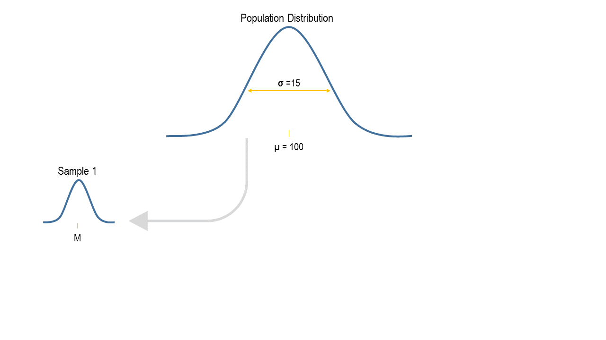
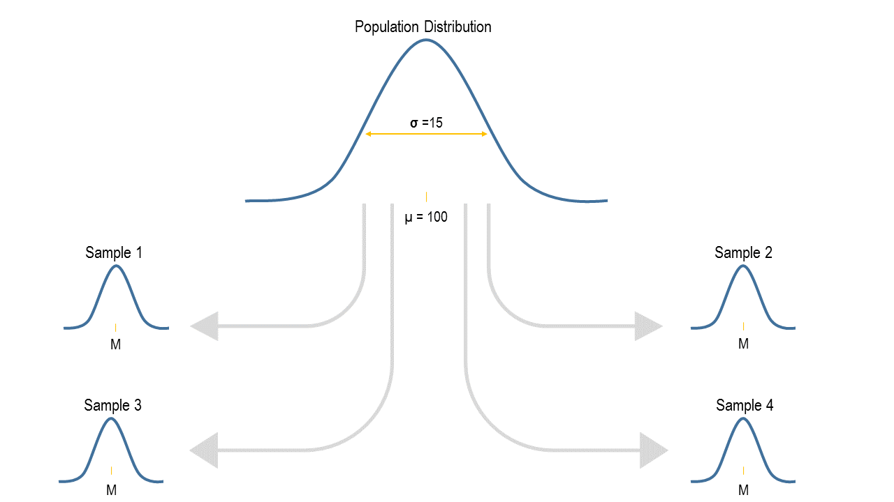
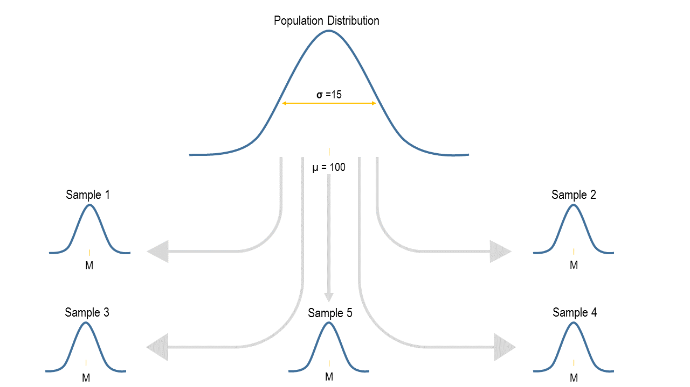

# Lecture 2
Jeremy Albright - Methods  
Monday, February 01, 2016  

## Null Hypothesis Significance Testing

20th century statistical analysis focused on inferring population characteristics on the basis of a sample.

Data were expensive to collect, while computers were limited by memory and processing speeds.

So we take a sample and analyze that, then generalize back to the population.

## Null Hypothesis Significance Testing

The problem with sampling: Our sample estimate will almost always be wrong.

There is the true population _parameter_, and then there is our sample _statistic_.  

The distance between our estimated statistic and the population parameter is known as _sampling error_.

## Null Hypothesis Significance Testing

A sample mean is almost surely not the population value we really want to know.

The interesting thing is that, while we know we are wrong, we can actually say something about how wrong we are likely to be!

This is, for example, the reason why we see survey results published with a _margin of error_.

Our ability to quantify our level of wrongness comes from in large part from a result known as the _Central Limit Theorem_.  

This result works if we think of our sample as one of all possible samples of size $n$ that can be taken from a population.

## The Central Limit Theorem

Take a population distribution:

## The Central Limit Theorem

Draw a sample, calculate the mean.

## The Central Limit Theorem

Then draw another sample, calculate the mean.

## The Central Limit Theorem

Do it again and again and again.

## The Central Limit Theorem

Do it again and again and again.

## The Central Limit Theorem

Do it again and again and again.

## The Central Limit Theorem

Now think of these individual means as data points.  They can form a distribution called _the distribution of means_.

More generally, we call this the _sampling distribution_.  

## The Central Limit Theorem

Not the difference:

- Sample distribution: The distribution of individual data points from one sample.
- Sampling distribution: The distribution of a statistic calculated on repeated samples.

The CLT corresponds to the latter and provides essential information.  The first is fundamental.

> As the sample size $n$ gets larger, the sampling distribution of the mean (and many other statistics) converges to a normal distribution.

## The Central Limit Theorem

This result does not depend on the distribution of scores in the population.  Take, for example, the distribution of students across grades in a high school.

## The Central Limit Theorem

The mean of this population is $\mu = 10.5$, and the standard deviation is $\sigma = 1.119$.

Now let's draw 1000 different random samples of size 50 from this population of students and calculate the mean grade for each sample.

Then we'll create a histogram to view the distribution of means from the repeated samples.

## The Central Limit Theorem

| Sample | Mean  | 
|:------:|:------:|
| 1       | 10.46 |
| 2       | 10.52 |
| 3       | 10.74 |
| $\vdots$ | $\vdots$    |
| 998    | 10.58 |
| 999    | 10.6 |
| 1000    | 10.5 |

## The Central Limit Theorem

## The Central Limit Theorem

There is more.  While the CLT tells us the shape of the distribution, it is also relatively easy to show that

1. The mean of the sampling distribution is the same as the population mean.  That is, the average sample mean is the true population mean.
2. The standard deviation of the sampling distribution, which we call the _standard error_, is equal to $\sigma/\sqrt(n)$.

In other words, the amount of sample-to-sample variability depends on the standard deviation of population scores and the size of the sample we draw.

## The Central Limit Theorem

For our student example, the population mean was 10.5 and the standard deviation was 1.119.

We therefore expect the sampling distribution of means to be centered on 10.5 with a standard error of 
$$
\frac{1.119}{\sqrt{50}} = 0.158
$$
In fact, we get

* The mean of the sample means is 10.497.
* The standard error is 0.148

## Hypothesis Testing

If I know the population distribution, I will know the shape of the sampling distribution (provided $n$ is sufficiently large).

With this information, I can say how likely it is that a single sample was generated from a given population

Example: I know the population distribution of IQs has a mean of 100 and a standard deviation of 15.  

A "study group" of 100 undergraduates snorts some Adderall before taking the IQ test.

What is the probability that Adderall sniffing has no effect on IQ scores?

## Hypothesis Testing

If Adderall has no effect, then the mean IQ among Adderall sniffers should be the same as non-sniffers.  

If Adderall has an effect, then Adderall sniffers come from a different population with its own unique mean.  What should we infer?

We know that the distribution of means for IQ given $n = 100$ will:

1. Be normal
2. Be centered on 100 (the population mean)
3. Have a standard error equal to $\frac{15}{\sqrt{100}} = 1.5$.

## Hypothesis Testing

Our sample has a mean IQ of 103.  How likely is it that we would have observed this value if our sample were no different from the population?

## Hypothesis Testing

We now have the basis for hypothesis testing.

We specify a(n assumed) known state of the world. We then want to assess whether our sample belongs to this state.

1. The assumed state is known as the _null hypothesis_.
2. Given a null hypothesis, we can - by the CLT - generate the _sampling distribution_.
3. We compare our sample statistic to the sampling distribution.
4. If our statistic is sufficiently unlikely given the null hypothesis, we reject the null.

This begs the question, what is _sufficiently unlikely_?

## Hypothesis Testing

We specify a certain level of acceptable error, which we refer to as $\alpha$ (alpha).

By convention, a typical level for $\alpha$ is .05.  What this means is that we are willing to accept the possibility that 5% of the time we will incorrectly reject the null hyopthesis.

For our IQ example, we know what the sampling distribution will look like.  If $\alpha$ = .05:

## Hypothesis Testing

## Hypothesis Testing

But what if we thought our sample was from a population the performed _worse_ on the IQ test?

## Hypothesis Testing

What if we're ambivalent?

## Hypothesis Testing

We can make a couple of choices about what evidence is _good enough_ to reject the null hypothesis.

1. Set $\alpha$: Smaller values mean less of a chance of mistakenly rejecting the null hypothesis.
2. Choose a one-sided or two-sided test.

By convention, set $\alpha = .05$ and use a two-tailed test.

$\alpha$ is also called the _Type-1 Error Rate_, where a Type-1 error occurs when you mistakenly reject the null hypothesis.

Note that making $\alpha$ smaller reduces Type-1 errors, but it also makes it harder to _correctly_ reject a null hypothsis.

Failure to reject a null when you should is called a _Type-2 Error_.

## Hypothesis Testing Example

Let's say I think IQ test performance is better after exercise.  I take a sample of 25 individuals and have them exercise for an hour before taking the test.

The mean IQ test following exercise is 104.

I set $\alpha = .05$ and specify that I will perform a two-tailed test.  Can I reject the null?

Note that the sample size changed, so the standard error is now $\frac{15}{\sqrt{25}} = 3$.  This means the sampling distribution is a little wider than before.

## Hypothesis Testing Example

## Hypothesis Testing Example

## Hypothesis Testing Example

Conclusion: Do not reject the null hypothesis.

But compare what happens if we had a sample size of 100.  In that case, the standard error would be $\frac{15}{\sqrt{100}} = 1.5$

Because $SE = \frac{\sigma}{\sqrt{n}}$, increasing $n$ -- the sample size -- will reduce sampling variability.

In other words, the more data we have, the greater certainty we can have in an estimate. 

## Hypothesis Testing Example

## Hypothesis Testing Example

## Hypothesis Testing Example

Notice that in each of these graphs we denote the area under the curve in the tails with $p$, for probability of observing a statistic at least this far from the null hypothesis population mean.

This is the _p-value_.  We want $p$ to be less than $\alpha$.

Note that, since this is a two-tailed test, we add up the area in the tails on both sides of the distribution.  You will see

1. When $n = 25$, $p = .182 > .05$.
2. When $n = 100$, $p = .008 < .05$.

## Hypothesis Testing Example

## Hypothesis Testing Example

## Means as Z-Statistics

Recall from the last lecture that we can convert scores on any scale (with any mean and standard deviation) to $z$ scores, which have a zero mean and standard deviation of 1.  We used the formula

$$
z = \frac{x - \mu}{\sigma}
$$

We can do the same with means.  Let $M$ be a sample mean, $\mu$ the population means, and SE be the standard error, $\sigma/\sqrt{n}$.  Then

$$
z = \frac{M - \mu}{\text{SE}}
$$

## Means as Z-Statistics

For the IQ example with $M = 104$ and $n = 25$, SE = $15/\sqrt{25} = 3$.  Converted to a $z$ statistic,

$$
z = \frac{104 - 100}{3} = 1.333.
$$

Had $n$ been 100, then SE = $15/\sqrt{100} = 1.5$, meaning 

$$
z = \frac{104 - 100}{1.5} = 2.667.
$$

## Means as Z-Statistics

## Means as Z-Statistics

## Means as Z-Statistics

Why bother with this transformation?

- Historically, needed to rely on tables to find the area under the sampling distribution curve. 
- But there is an infinite number of normal distributions.
- By making this conversion, the sampling distribution will always be the _unit_ or _standard normal_ distribution.
- Then you just need one table.  
    - Calculate the statistic.
    - Divide by standard error to get $z$.
    - Find associated area in the tail(s) of the standard normal distribution.

This is also how statistical software outputs results.

## Review

Before covering one last topic, make sure you understand the following:

1. If we know the mean $\mu$ and standard deviation $\sigma$ of a population, we know exactly what the sampling distribution of the mean will look like across repeated samples of size $n$.  
    + It will be normal.
    + It will be centered on zero.
    + It will have a standard deviation (more specifically, standard error) equal to $\frac{\sigma}{\sqrt{n}}$.
2. We can therefore assert a null hypothesis and know what the sampling distribution looks like given the null.

## Review

Furthermore, 

1. If our sample mean $M$ is sufficiently unlikely under the null hypothesis, we reject the null.
2. _Sufficiently unlikey_ is below a probability threshold, $\alpha$, usually set at .05 and distributed between the upper and lower tails of the distribution.
3. We can convert our mean to a $z$ statistic if that makes it easier to find the associated $p$-value.

This rests on knowing $\mu$ and $\sigma$.  What if we don't have enough information about the null population to know $\sigma$?

## The t distribution

We rarely know $\sigma$.  This means we can't know the sampling distribution without some further assumptions.

We _assume_ that our sample can provide an unbiased estimate of the population variance/standard deviation.  

Equivalently, we are saying that, even if our sample comes from a different population with a different mean, the variances in both populations are the same.

Recall our unbiased estimate of $\sigma$ is

$$
s = \frac{\sum_{i}^{N} \left(x_i - M\right)^2}{n - 1}
$$

where we call $n-1$ the _degrees of freedom_.

## The t distribution

So now we have an estimate of $\sigma$ that is unbiased.  We can now determine the standard error of the sampling distribution by substituting our estimate in for $\sigma$,

$$
\text{SE} = \frac{s}{\sqrt{n}}
$$

However, the fact that $s$ is just an _estimate_ means we have some added uncertainty in our hypothesis testing.  The normal distribution won't do.

Instead, we turn to the $t$ distribution.

## The t distribution

More specifically, there is no single $t$ distribution.  Instead, there is a different $t$ distribution depending on what our degrees of freedom are.

Since $df = n - 1$, this is equivalent to saying that the $t$ distribution we consider changes depending on what $n$ is.

When $n$ is small, the $t$ distribution we use will have fatter tails than the normal.  This captures the added uncertainty we have in our hypothesis testing -- it makes it a little harder to declare something significant -- when we have to make a guess as to what $\sigma$ is.

To illustrate:

## The t distribution

    
    
## The t distribution

As $df$ increases, $t$ looks more and more like a normal distribution.

Intuitively, the more data we have, the less error we can have in our estimate of the true population parameter $\sigma$.

With less error, we reduce the need to introduce a conservative adjustment (the fatter tails) in the sampling distribution we use to declare statistical significance.

## The t distribution

Let's take a look at Republican vote share from our example data.

## The t distribution

These data are not normally distributed.  Why doesn't this matter for hypothesis testing?

Summary statistics are:

- $n = 435$
- $M = 50.502$
- $s^2 = 287.458$
- $s = \sqrt{s^2} = 16.955$

Imagine that there is a super-population of US elections in which the mean district Republican vote share is 52.25 percent.  

Can we reject the null hypothesis that this election is like the others in that super-population?

## The t distribution

The $t$ distribution, like the unit normal, is centered on zero.  We therefore convert our estimate of the mean to be a $t$ statistic.  This works just like how we calculated the $z$ statistic:

$$
t = \frac{M - \mu}{\text{SE}}
$$

The only difference is that our estimate of SE uses our sample estimate $s$ in place of $\sigma$.

$$
\text{SE} = \frac{s}{\sqrt{n}} = \frac{16.955}{\sqrt{435}} = 0.813
$$

## The t distribution
Substituting into our formula for $t$,

$$
t = \frac{50.502 - 52.25}{0.813} = -2.15.
$$

Let's compare this to a $t$ distribution with $n - 1 = 434$ degrees of freedom.

## The t distribution

## The t distribution

We already saw that hypothesis tests depend on sample size.  As $n$ gets larger, SE gets smaller.

SE is part of the formula for $t$, just as it was for $z$, so the same behavior occurs for tests based on $t$.

But sample size also matters because it affects the degrees of freedom, which in turn affect the specific $t$ distribution we utilize.

Keeping $M = 50.502$ and $\mu = 52.25$, what would be the results with different sample sizes?

## The t distribution

## The t distribution

## The t distribution

## The t distribution

## Summary

1. Hypothesis testing is done by asserting a null hypothesis and then determining the probability that our sample could have come from the null population.
2. If we don't know the null population's variance, we plug in our sample estimate.
3. The need to estimate the unknown variance introduces an additional source of uncertainty into our hypothesis testing.
4. We therefore use the $t$ distribution -- which has fatter tails than the normal -- to make our tests a bit more conservative.

